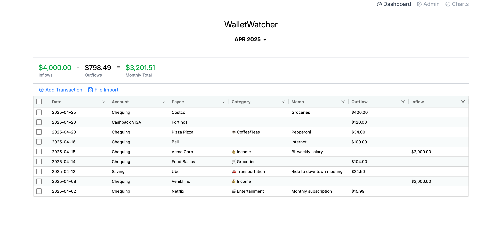
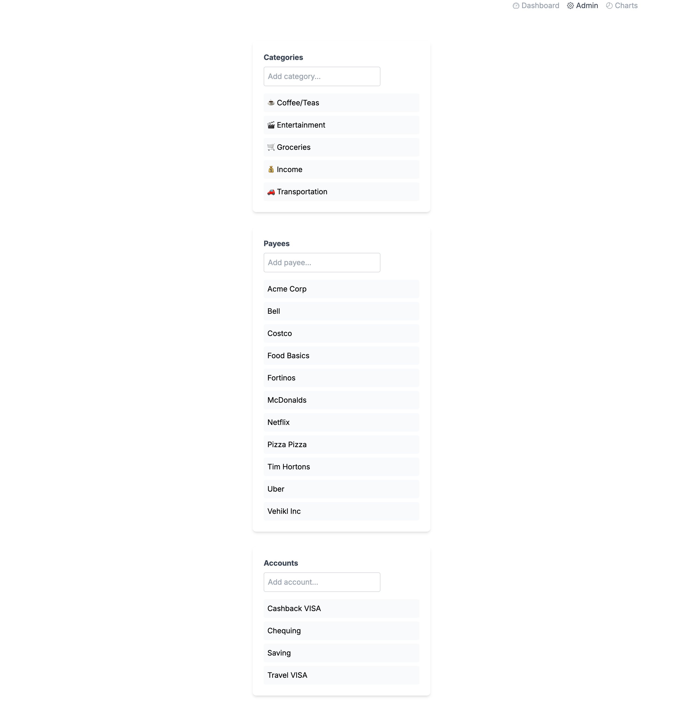
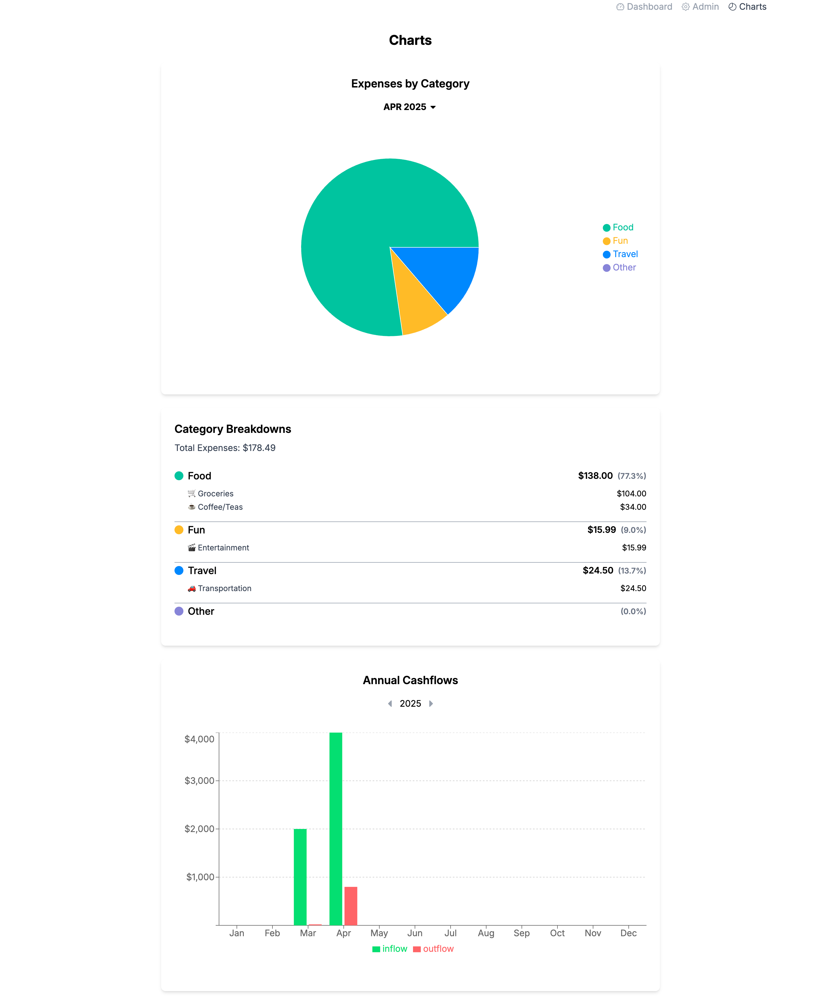

# Wallet Watcher

A modern web application for tracking monthly transactions, built with React, TypeScript, and Supabase.

## Features

- User authentication and management
- Create and manage multiple wallets
- Track deposits and withdrawals
- Transaction history for each wallet
- Built with React, TypeScript, and TailwindCSS
- Supabase as the backend (PostgreSQL)







## Getting Started

### Prerequisites

- [Node.js](https://nodejs.org/) (v16+ recommended)
- [npm](https://www.npmjs.com/)
- [Supabase account](https://supabase.com/)

### Installation

1. **Clone the repository:**

2. **Install dependencies:**
   ```bash
   npm install
   ```

3. **Set up environment variables:**
    - Copy `.env.example` to `.env` and fill in your Supabase credentials.

4. **Set up the database:**
    - Use the provided `schema.md` file to create the necessary tables in your Supabase project.
    - In the Supabase dashboard, go to SQL Editor and run the contents of `schema.md`.
    - Add RLS (Row Level Security) to tables in Supabase.

### Development

Start the development server:

```bash
npm run dev
```

Visit [http://localhost:5173](http://localhost:5173) to view the app.

### Building for Production

```bash
npm run build
```

## Database Schema

See [`schema.md`](./schema.md) for the full database structure.

## Contributing

Pull requests are welcome! For major changes, please open an issue first to discuss what you would like to change.
